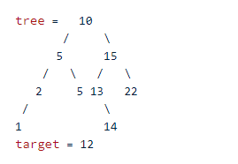

Write a function that takes in a Binary Search Tree (BST) and a target integer value and returns the closest value to that target value
contained in the BST.

You can assume that there will only be one closest value.

Each `BST` node has an integer `value` , a `left` child node, and a `right` child node. Anode is said to be a valid `BST` node if and
only if it satisfies the BST property: its `value` is strictly greater than the values of every node to fts left; its `value` is less than or equal
to the values of every node to its right; and its children nodes are either valid `BST` nodes themselves or `None` / `null`

### Sample Input



### Sample Output

```javascript
13;
```
